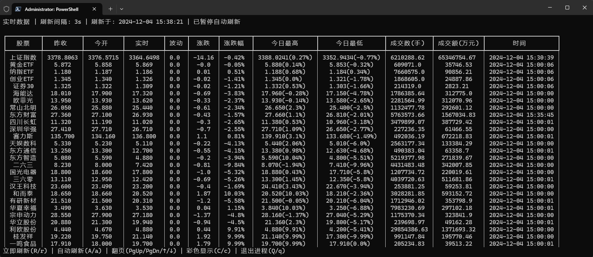
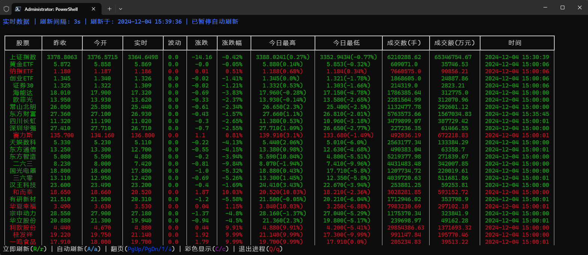
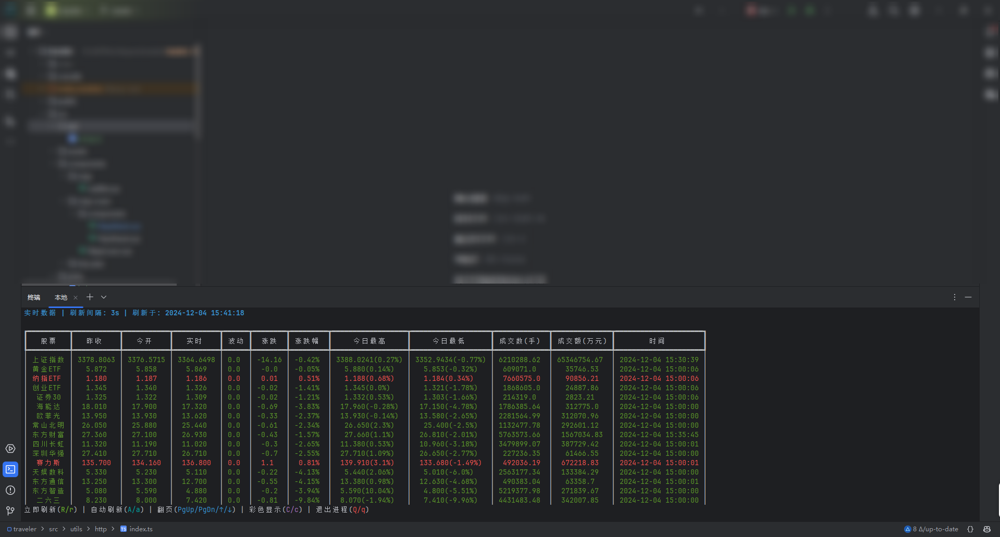

# stock_terminal

## 说明

用于在终端控制台实时显示股票信息的小工具

特色：

- 价格实时显示
- 自动刷新
- 终端彩色显示
- 股票异动监控(短时间内快速拉升/快速下跌)
- 个股监控(价格监控/涨跌幅监控)
- 界面简单而不失实用

嗯，没了😎

## 运行

需要安装以下依赖

```shell
pip install urwid requests rich chinese_calendar plyer
```

终端运行

```shell
python ./stock_terminal.py 
```

## 配置

代码中提供如下配置项，可根据需要修改

```python
# 是否开启自动刷新(非交易时间默认关闭，可手动开启)
auto_refresh = True
# 是否启用调色板(彩色输出)
use_palette = False
# 自动刷新间隔(s)(接口的数据更新频率为3s)
refresh_duration = 3
# 股票代码
tickers = []
```

## 效果






